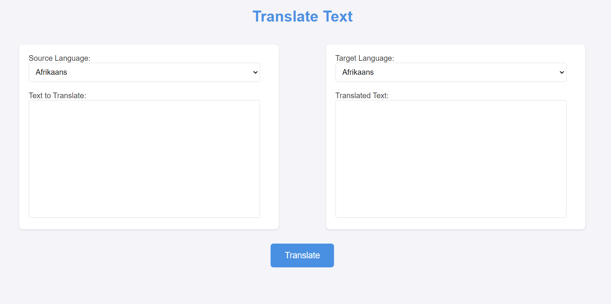

# ParallelTranslator

Parallel Translator is a web application built with Java and Spring Boot for translating a set of words into another language using a third-party translation service MyMemory API. Each word is translated in separate threads with a maximum of 10 concurrent threads. The application also logs translation requests to a PostgreSQL database.

## Technologies

- Java 17
- Spring Boot 3.3.2
- PostgreSQL 16
- JDBC
- RestTemplate
- Docker
- HTML + JS

## Requirements

- Java 17
- Maven
- Docker and Docker Compose

## Installation and Setup

1. **Clone the repository:**

    ```sh
    git clone https://github.com/yourusername/ParallelTranslator.git
    cd ParallelTranslator
    ```

2. **Build the project using Maven:**

    ```sh
    ./mvnw clean package
    ```

3. **Run the application using Docker Compose:**

    ```sh
    docker-compose build --no-cache
    docker-compose up
    ```

4. **Shut down the application:**

    ```sh
    docker-compose down
    ```

## Usage

Once the application is running, it will be accessible at [http://localhost:8080/api/translate](http://localhost:8080/api/translate).

### Web Interface

Here is a screenshot of the main page of the web application:



If you navigate to a non-existent page, you will see a custom error page. For example, try visiting [http://localhost:8080/nonexistent](http://localhost:8080/nonexistent).


### API Endpoints

#### Translate Text

- **Endpoint:** `/api/translate`
- **Method:** POST
- **Request Body:**
    ```json
    {
        "text": "your text here",
        "sourceLang": "en",
        "targetLang": "es"
    }
    ```
- **Response:**
    ```json
    "your translated text here"
    ```

### Example

1. **Send a translation request:**

    ```sh
    curl -X POST -H "Content-Type: application/json" -d '{"text": "hello world", "sourceLang": "en", "targetLang": "es"}' http://localhost:8080/api/translate
    ```

2. **Response:**
    ```json
    "hola mundo"
    ```

## Accessing the Database

You can view the PostgreSQL database this way:

1. **Access the PostgreSQL container:**
    ```sh
    docker exec -it postgres psql -U postgres -d TranslatorDB
    ```

2. **List all entries in `api_translation_requests_logs`:**
    ```sql
    SELECT * FROM api_translation_requests_logs;
    ```

3. **Exit the PostgreSQL command line:**
    ```sh
    \q
    ```

## Viewing Javadoc

To view the Javadoc documentation:

1. **Generate Javadoc:**

   Run the following Maven command to generate the Javadoc:

    ```sh
    ./mvnw javadoc:javadoc
    ```

2. **Navigate to the Javadoc directory:**

   The Javadoc will be generated in the `target/site/apidocs` directory.

3. **Open the Javadoc in a web browser:**

   [Click here to view the Javadoc](target/site/apidocs/index.html).
## License

This project is licensed under the MIT License. See the [LICENSE](LICENSE) file for details.

## Additional Information

- The application is designed to handle translation of individual words concurrently using up to 10 threads.
- All translation requests are logged into the `api_translation_requests_logs` table with the following structure:
    - `id` (integer, primary key)
    - `client_ip` (varchar(45), not null)
    - `text` (text, not null)
    - `translated_text` (text, not null)
    - `created_at` (timestamp, default current timestamp)

## Contact

For any issues or questions, please open an issue on GitHub or contact me.

---

© 2024 Alexander Garifullin. All rights reserved.
